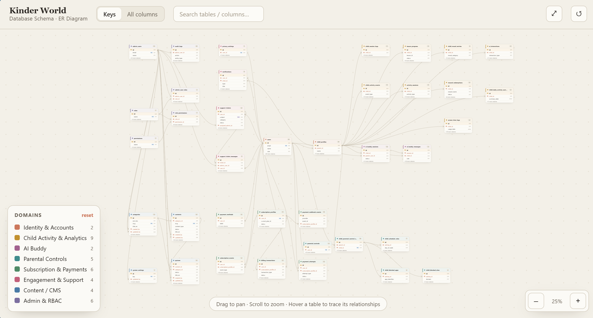

# Kinder World

Kinder World is a multi-role educational and parental-control platform built with Flutter and FastAPI.

This README reflects the current codebase, not legacy docs.

## Database Schema

[](https://alaa-hany.github.io/graduation-project/kinderbackend/docs/Kinder_World_ERD.html)

**[👉 Open Interactive ERD →](https://alaa-hany.github.io/graduation-project/kinderbackend/docs/Kinder_World_ERD.html)**

*Click the diagram to explore the interactive version*

## Overview

The repository contains:

- `kinderbackend/`: FastAPI backend with SQLAlchemy models, service-layer logic, and `pytest` tests
- `kinder_world_child_mode/`: Flutter client with Riverpod, GoRouter, local storage, and widget/unit tests
- `.github/workflows/`: backend and Flutter CI

Main user contexts:

- `Parent`: manages children, views reports, uses parental controls, handles support, and manages paid access
- `Child`: signs in with a picture-password flow and uses the child learning/play experience
- `Admin`: uses a separate auth system and RBAC-protected management surfaces

## Current Product Flows

### Parent

- Parent registration, login, refresh, logout
- Parent profile update and password change
- Parent PIN setup, verification, change, and reset request
- Child profile creation, update, listing, and deletion
- Parent dashboard, reports, notifications, privacy settings, and parental controls
- Support ticket creation, history, detail, and replies
- One-time purchase flow with provider checkout and lifetime premium entitlement

### Child

- Child registration and login endpoints
- Picture-password-based child authentication
- Child session validation
- Child change-password flow
- Child home, learn, play, AI buddy, profile, achievements, and store routes
- Child home presentation surfaces prefer real data and hide unsupported sections instead of showing placeholder cards
- Voice interaction via AI buddy: ASR (speech-to-text) and TTS (text-to-speech) endpoints

### Admin

- Dedicated admin login, refresh, logout, and profile retrieval
- RBAC-protected admin routes
- Admin user, child, analytics, audit, support, content, subscription, settings, and diagnostics management
- Two-factor authentication (TOTP) for admin accounts

### Reports

- Parent reports include KPIs, trends, sessions, and short interpretation cards
- Insights are intentionally evidence-backed and weak-signal insights are hidden when data is too thin

## Payments

The current paid-access model is:

- `one-time purchase`
- `lifetime access`

Parent-facing recurring semantics are intentionally disabled in the main flow:

- `POST /subscription/cancel` returns `410`
- `POST /subscription/manage` returns `410`
- `POST /billing/portal` returns `410`

Backend plan metadata currently exposes:

- `billing_type = one_time`
- `access_type = lifetime` for paid plans

The Flutter purchase UI is aligned to this model and avoids parent-facing monthly or renewal language in the presentation flow.

## Architecture Summary

### Backend

Practical layered structure:

- `routers/`: HTTP endpoints and request wiring
- `services/`: domain and business logic
- `schemas/`: Pydantic request/response models
- `models.py` and `admin_models.py`: SQLAlchemy models
- `deps.py` and `admin_deps.py`: auth, RBAC, and database dependencies
- `core/`: settings, logging, exception handling, validators, security helpers

Notable backend modules:

- `services/auth_service.py`: parent auth, profile, password, parent PIN
- `services/child_service.py`: child registration/login/session/password and child profile operations
- `services/support_ticket_service.py`: parent/admin support flows
- `services/admin_auth_service.py`: admin auth and security logic
- `services/subscription_service.py`: one-time purchase state, entitlement unlock, refunds, and plan selection logic
- `services/analytics_service.py` / `analytics_ingestion_service.py` / `analytics_report_service.py`: analytics ingestion and report construction
- `services/ai_buddy_service.py` and sub-modules: AI buddy orchestration, content, moderation, persistence, response generation, and visibility
- `services/voice_service.py`: ASR and TTS for the voice feature
- `services/two_factor_service.py`: TOTP-based two-factor authentication
- `services/payment_provider.py` / `payment_providers/`: pluggable payment backend (internal or Stripe)
- `services/payment_webhook_service.py` / `payment_webhook_verifier.py`: inbound webhook handling and verification
- `services/payment_reconciliation_service.py`: payment reconciliation job
- `services/premium_behavior_service.py`: premium feature gating logic
- `services/parental_controls_service.py`: parental control rule evaluation
- `services/email_delivery_service.py`: transactional email delivery
- `services/media_service.py`: media upload and management
- `services/data_lifecycle_service.py`: analytics retention and data-lifecycle operations

### Frontend

The Flutter app uses:

- `Riverpod` for state and dependency injection
- `GoRouter` for navigation and access guards
- `Hive` for local persistence
- `SharedPreferences` for lightweight persisted flags
- `SecureStorage` for auth and session data

Main frontend areas:

- `features/app_core`
- `features/auth`
- `features/child_mode`
- `features/parent_mode`
- `features/admin`
- `features/system_pages`

Current presentation-focused behavior:

- Parent reports use short interpretation instead of raw metrics only
- Child home hides unsupported cards instead of showing misleading placeholders
- Purchase screens present one-time purchase and lifetime access only

## Project Structure

```text
.
|-- .github/
|   `-- workflows/
|       |-- backend-ci.yml
|       `-- flutter-ci.yml
|-- kinderbackend/
|   |-- alembic/
|   |-- core/
|   |-- routers/
|   |-- schemas/
|   |-- services/
|   |-- admin_models.py
|   |-- auth.py
|   |-- conftest.py
|   |-- database.py
|   |-- deps.py
|   |-- main.py
|   |-- models.py
|   |-- pytest.ini
|   `-- test_*.py
`-- kinder_world_child_mode/
    |-- assets/
    |-- lib/
    |   |-- core/
    |   |-- features/
    |   |-- routing/
    |   |-- app.dart
    |   |-- main.dart
    |   `-- router.dart
    |-- test/
    |-- pubspec.yaml
    `-- analysis_options.yaml
```

## Authentication and Roles

### Parent Authentication

Current parent auth endpoints include:

- `POST /auth/register`
- `POST /auth/login`
- `POST /auth/refresh`
- `GET /auth/me`
- `PUT /auth/profile`
- `POST /auth/change-password`
- `POST /auth/logout`

Parent PIN endpoints:

- `GET /auth/parent-pin/status`
- `POST /auth/parent-pin/set`
- `POST /auth/parent-pin/verify`
- `POST /auth/parent-pin/change`
- `POST /auth/parent-pin/reset-request`

### Child Authentication

Current child auth endpoints include:

- `POST /auth/child/register`
- `POST /auth/child/login`
- `POST /auth/child/session/validate`
- `POST /auth/child/change-password`

### Admin Authentication

Current admin auth endpoints include:

- `POST /admin/auth/login`
- `POST /admin/auth/refresh`
- `POST /admin/auth/logout`
- `GET /admin/auth/me`

Roles present in code:

- `parent`
- `child`
- `admin`

## Backend Overview

Backend entrypoint: `kinderbackend/main.py`

The API is served under two version prefixes: `/api/v1` (legacy-compatible, no envelope) and `/api/v2` (envelope-wrapped responses). Most routers are mounted under both.

The app currently includes routers for:

- public auth
- parent auth
- children
- notifications
- privacy
- content/legal
- support
- subscriptions
- billing methods
- feature-gated reports, notifications, parental controls, AI, and downloads
- AI buddy (voice ASR/TTS)
- voice
- payment webhooks
- health
- admin auth
- admin users
- admin children
- admin analytics
- admin audit
- admin support
- admin CMS
- admin subscriptions
- admin settings
- admin diagnostics
- admin admins
- optional admin seed

Database behavior:

- default local database: `sqlite:///kinder.db`
- PostgreSQL supported via `DATABASE_URL`
- Alembic is present for migrations
- startup schema verification exists and can be skipped with env flags
- optional Redis-backed read-path cache (`CACHE_ENABLED`, `REDIS_URL`)
- optional Sentry error tracking (`SENTRY_DSN`)

## Frontend Overview

Flutter entrypoint: `kinder_world_child_mode/lib/main.dart`

Current startup behavior includes:

- Hive initialization
- secure storage preload
- shared preferences init
- logger injection
- app-level error handling

Routing guards enforce:

- public vs authenticated entry
- parent vs child separation
- admin auth state
- admin permission checks
- parent PIN protection for parent routes

## Testing

### Backend

Backend tests use `pytest` with shared fixtures in `kinderbackend/conftest.py`.

Current backend coverage areas include:

- auth and admin auth (including brute-force protection, token helpers, security regressions, and time regression)
- RBAC and admin sensitive permissions
- support (including support ticket enhancements)
- subscriptions, paid access, subscription lifecycle and history, and provider integration
- parent/child flows and settings
- parent PIN flows
- AI buddy backend, safety, and visibility
- two-factor authentication flows
- payment webhooks and reconciliation
- email OTP verification
- HTTP security headers and CORS regression
- health endpoints
- observability (events and logging)
- Redis and cache service
- data protection at rest
- DB migration reliability and relational deletion behavior
- rate limits and sensitive rate limits
- internal provider guard and premium rules
- public content routes and OpenAPI docs
- presentation-focused smoke flows

Useful commands:

```bash
cd kinderbackend
python -m pytest -q
python -m mypy
python -m pytest -q --cov=. --cov-fail-under=70 --cov-report=term-missing:skip-covered
```

The current presentation smoke file is:

- `kinderbackend/test_presentation_smoke_flows.py`

It covers:

- parent login
- child login
- child activity flow
- parent reports
- admin login
- one-time purchase success
- premium entitlement unlock

### Flutter

Flutter tests live under `kinder_world_child_mode/test/` and include:

- unit tests
- repository and session tests
- widget tests
- routing and startup tests
- admin, parent, and child flow tests
- focused presentation smoke tests for the core demo journeys

Useful commands:

```bash
cd kinder_world_child_mode
flutter analyze
flutter test
flutter test --coverage
```

The current presentation smoke file is:

- `kinder_world_child_mode/test/presentation_smoke_test.dart`

It covers:

- parent login
- child login
- child activity flow
- parent reports
- admin login
- one-time purchase success
- premium entitlement unlock

## Running Locally

### Backend

Prerequisites:

- Python 3.11 recommended
- `pip`
- optional PostgreSQL

Setup:

```bash
cd kinderbackend
python -m venv .venv
```

Windows:

```bash
.venv\Scripts\activate
```

Linux/macOS:

```bash
source .venv/bin/activate
```

Install dependencies:

```bash
pip install --upgrade pip
pip install -r requirements-dev.txt
```

Minimal local environment:

- create `kinderbackend/.env`
- copy values from `kinderbackend/.env.example`
- set `KINDER_JWT_SECRET`

Optional local settings:

```env
ENVIRONMENT=development
DATABASE_URL=
SKIP_SCHEMA_VERIFY=false
AUTO_RUN_MIGRATIONS=false
```

Optional integrations:

- Email OTP verification uses SMTP settings such as `SMTP_HOST`, `SMTP_USERNAME`, and `SMTP_PASSWORD`.
- Admin video uploads use Cloudinary settings such as `CLOUDINARY_CLOUD_NAME`, `CLOUDINARY_API_KEY`, and `CLOUDINARY_API_SECRET`.
- Stripe payment provider requires `STRIPE_SECRET_KEY`, `STRIPE_WEBHOOK_SECRET`, and related price/URL settings. Set `PAYMENT_PROVIDER=stripe` to enable; the default is `internal`.
- AI buddy responses require an OpenAI-compatible key via `AI_PROVIDER_API_KEY`. Set `AI_PROVIDER_MODE=fallback` to gracefully degrade when no key is present.
- Redis caching is optional. Set `CACHE_ENABLED=true` and `REDIS_URL` to enable read-path caching.
- Sentry error tracking is optional via `SENTRY_DSN`.
- If these optional settings are empty, the rest of the local app can still run, but the corresponding features will not be fully configured.

Run:

```bash
cd kinderbackend
python -m uvicorn main:app --reload --host 0.0.0.0 --port 8000
```

### Flutter

Prerequisites:

- Flutter SDK
- platform tooling for your target

Install dependencies:

```bash
cd kinder_world_child_mode
flutter pub get
```

Run against local backend:

```bash
cd kinder_world_child_mode
flutter run --dart-define=API_BASE_URL=http://127.0.0.1:8000
```

Environment-driven example:

```bash
flutter run --dart-define=APP_ENV=development --dart-define=DEV_API_BASE_URL=http://127.0.0.1:8000
```

## Environment Variables

### Backend

Common backend environment variables recognized in code include:

Runtime and logging:

- `ENVIRONMENT`
- `APP_LOG_FILE`
- `APP_LOG_LEVEL`

CORS:

- `ALLOWED_ORIGINS`
- `ALLOWED_ORIGIN_REGEX`
- `CORS_ALLOW_CREDENTIALS`

Database:

- `DATABASE_URL`
- `DB_POOL_SIZE`
- `DB_MAX_OVERFLOW`
- `DB_POOL_RECYCLE_SECONDS`
- `SKIP_SCHEMA_VERIFY`
- `AUTO_RUN_MIGRATIONS`

Cache / Redis:

- `CACHE_ENABLED`
- `REDIS_URL`
- `ADMIN_ANALYTICS_CACHE_TTL_SECONDS`

JWT / Auth secrets:

- `KINDER_JWT_SECRET`
- `JWT_SECRET_KEY`
- `SECRET_KEY`
- `JWT_ALGORITHM`
- `JWT_ACTIVE_KID`
- `JWT_PREVIOUS_SECRETS`

Data encryption:

- `DATA_ENCRYPTION_KEY`
- `DATA_ENCRYPTION_PREVIOUS_KEYS`

Email domain policy:

- `EMAIL_DOMAIN_ALLOWLIST`
- `EMAIL_DOMAIN_DENYLIST`

SMTP / Email OTP:

- `SMTP_HOST`
- `SMTP_PORT`
- `SMTP_USERNAME`
- `SMTP_PASSWORD`
- `SMTP_FROM_EMAIL`
- `SMTP_FROM_NAME`
- `SMTP_USE_SSL`
- `SMTP_USE_TLS`
- `EMAIL_OTP_EXPIRES_MINUTES`
- `EMAIL_OTP_RESEND_COOLDOWN_SECONDS`

Child auth hardening:

- `CHILD_AUTH_RATE_LIMIT_MAX_ATTEMPTS`
- `CHILD_AUTH_RATE_LIMIT_WINDOW_SECONDS`
- `CHILD_AUTH_SUSPICIOUS_THRESHOLD`
- `CHILD_SESSION_TTL_MINUTES`
- `CHILD_AUTH_DEVICE_BINDING_ENABLED`
- `CHILD_AUTH_REQUIRE_DEVICE_ID`

Analytics lifecycle:

- `ANALYTICS_RETENTION_DAYS`
- `ANALYTICS_SUMMARY_RETENTION_DAYS`

Payments:

- `PAYMENT_PROVIDER` (`internal` or `stripe`)
- `STRIPE_SECRET_KEY`
- `STRIPE_PUBLISHABLE_KEY`
- `STRIPE_WEBHOOK_SECRET`
- `STRIPE_CHECKOUT_SUCCESS_URL`
- `STRIPE_CHECKOUT_CANCEL_URL`
- `STRIPE_PORTAL_RETURN_URL`
- `STRIPE_PRICE_PREMIUM_MONTHLY`
- `STRIPE_PRICE_FAMILY_PLUS_MONTHLY`

AI provider:

- `AI_PROVIDER_MODE`
- `AI_PROVIDER_API_KEY`
- `AI_MODEL`
- `AI_MAX_TOKENS`
- `AI_TEMPERATURE`

Media uploads (Cloudinary):

- `CLOUDINARY_CLOUD_NAME`
- `CLOUDINARY_API_KEY`
- `CLOUDINARY_API_SECRET`
- `CLOUDINARY_MEDIA_ROOT_FOLDER`
- `MEDIA_MAX_UPLOAD_SIZE_MB`

Observability:

- `SENTRY_DSN`

Admin seed (dev/test only):

- `ENABLE_ADMIN_SEED_ENDPOINT`
- `ADMIN_SEED_SECRET`
- `ADMIN_SEED_PASSWORD`
- `ADMIN_SEED_EMAIL`
- `ADMIN_SEED_NAME`

Admin auth hardening:

- `ADMIN_AUTH_MAX_FAILED_ATTEMPTS`
- `ADMIN_AUTH_LOCKOUT_MINUTES`
- `ADMIN_SUSPICIOUS_FAILED_THRESHOLD`
- `ADMIN_SENSITIVE_CONFIRMATION_REQUIRED`

### Frontend

Important frontend build-time settings:

- `API_BASE_URL`
- `APP_ENV`
- `DEV_API_BASE_URL`
- `STAGING_API_BASE_URL`
- `PROD_API_BASE_URL`

## Current Status / Known Limitations

These points are based on the current codebase behavior:

- Backend test coverage is stronger than the full Flutter test surface.
- Flutter API configuration is environment-driven, but staging and production still require explicit `--dart-define` values.
- Parent-facing paid access is one-time purchase with lifetime entitlement.
- Recurring parent billing semantics are intentionally disabled in the current parent flow.
- Some billing lifecycle fields still exist in backend and admin models for compatibility.
- Some content, legal, and help endpoints are still static data rather than a full managed CMS flow.
- Some premium and family features still rely on simplified or demo-style payloads instead of deep external integrations:
  - AI insights
  - offline downloads
  - priority support metadata
- Coverage gates are intentionally conservative today:
  - backend source coverage floor is `70%`
  - Flutter non-generated coverage floor is `28%`

## Future Improvements

Reasonable next improvements based on the current code structure:

- raise coverage thresholds gradually
- continue cleaning legacy recurring-payment compatibility fields after the one-time purchase migration
- replace placeholder or static legal/help content where needed
- continue extracting complex Flutter UI and state logic into smaller units
- expand backend coverage into weaker admin, content, and data-lifecycle areas
- expand Flutter coverage for repositories, reports, and route-dependent flows

## Notes

This README is a technical status document for contributors, reviewers, and academic evaluation. It intentionally reflects unfinished areas that still exist in the code.
